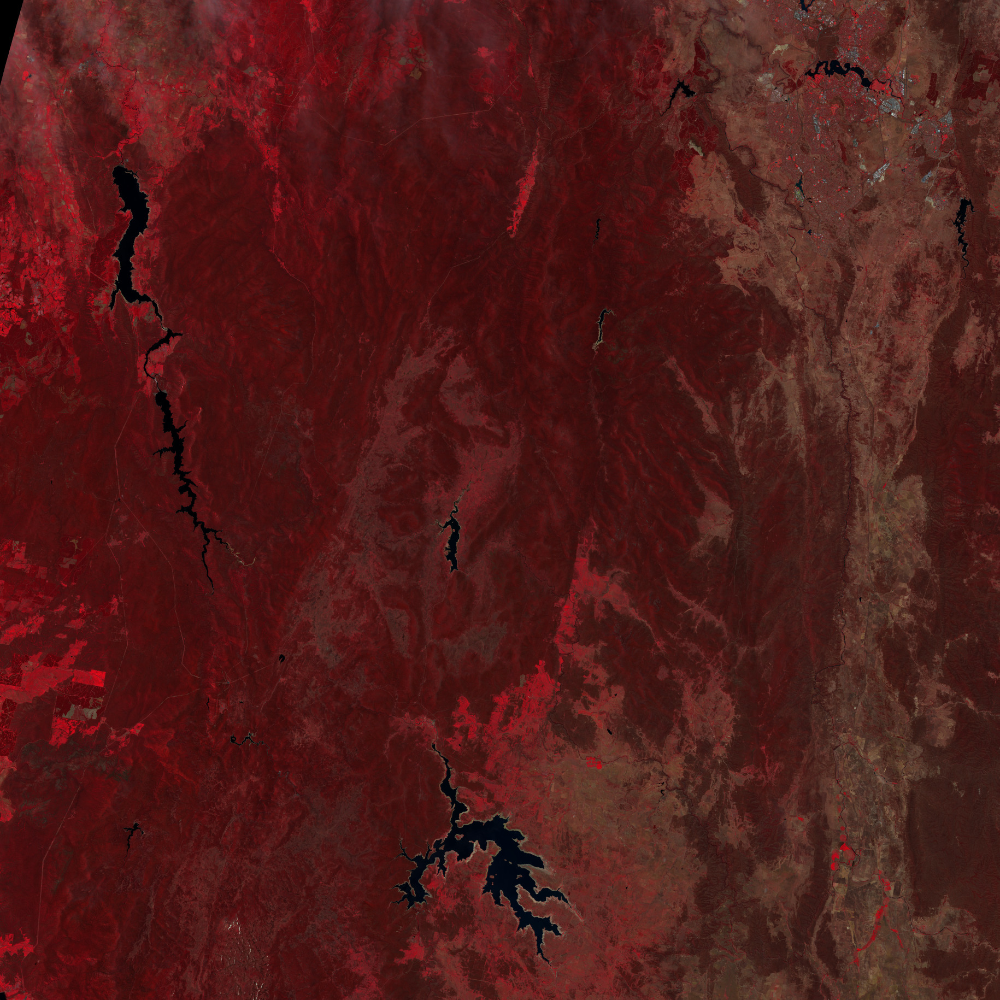
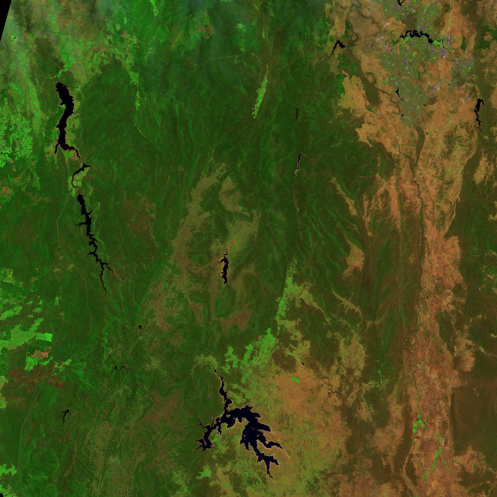
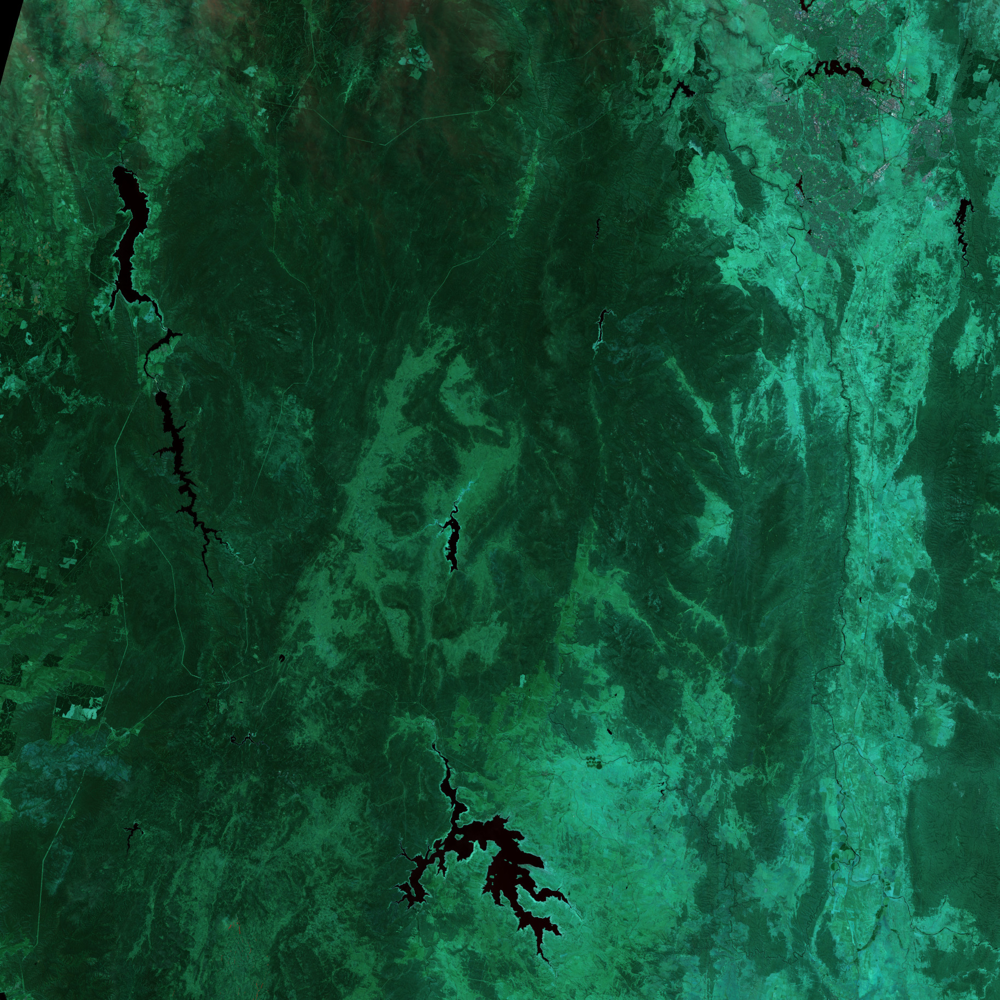
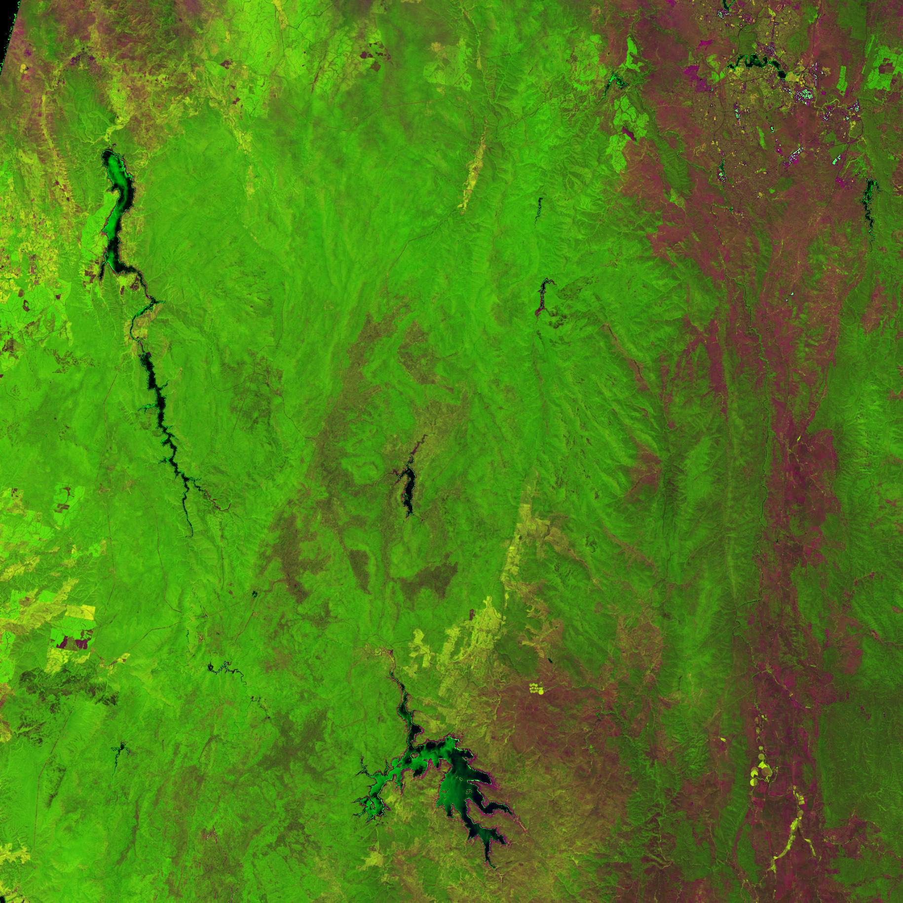

# Datathon Melbourne 2019

A React app that provides useful information (e.g. vegetation index, false color images etc.) using satellite images from Copernicus Sentinel 2.

Release 2.0 will include more features such as ndvi projection and whether forecast.

## Examples



Near infrared (red), green (blue), red (green). This is useful in seeing changes in plant health. Vegetation appears in different shades of red depending on the types and conditions of the vegetation, since it has a high reflectance in the NIR band. Plants are dark red because they reflect infrared light strongly, and the infrared band is assigned to be red. Plants that are growing quickly reflect more infrared, so they are brighter red. That means that this type of false-color image can help us see how well plants are growing and how densely vegetated an area is.



Shortwave infrared (red), near infrared (green), and green (blue), often used to show floods or newly burned land. In this false-color band combination, plant-covered land is bright green, water is black, and bare earth ranges from tan to pink. Newly burned farmland is dark red, while older burns are lighter red. Much of the farmland in this area is used to grow sugar cane. Farmers burn the crop before harvest to remove leaves from the canes. Because burned land looks different in this kind of false-color image, it is possible to see how extensively farmers rely on fire in this region.

Water absorbs all three wavelengths, so it is black in this band combination. However, water is blue if it is full of sediment. Sediment reflects visible light, which is assigned to look blue in this band combination. This means that both sediment-laden water and saturated soil will appear blue.


Blue (red), two different shortwave infrared bands (green and blue), useful to differentiate between snow, ice, and clouds.



At least three types of vegetation can be discriminated in this colour composite image: green, bright yellow and golden yellow areas. The green areas consist of dense trees with closed canopy. The bright yellow areas are covered with shrubs or less dense trees. The golden yellow areas are covered with green fields. The non vegetated areas appear in dark blue and magenta.

cite: [https://crisp.nus.edu.sg/~research/tutorial/opt_int.htm](https://crisp.nus.edu.sg/~research/tutorial/opt_int.htm), [https://earthobservatory.nasa.gov/features/FalseColor](https://earthobservatory.nasa.gov/features/FalseColor)

# Datathon Deployment Guide

This project is based on ReactJS and Python Web Server.

# Development Environment

### 1. Version Controlling

- `Github`:

### 2. Development Environment

##### Option 1: VSCode

Pre-conditions:

- Visual Studio Code
- Node.js

After cloning the project add the project using following steps.

- Right click on 'Open from Code' option to add the project into your workspace of Visual Studio Code

### 3. Database

Currently this project does not have any database. But in next phase we will release support of AWS S3 bucket and relational database connection.

# Project Structure

```
.
├── client                  # ReactJS Application
│   ├── public              # CSS files/ JavaScript files/ Static files
│   ├── src                 # ReactJS Server
├── img                     # image files
├── windowsplugins          # Python shapely plugins for windows
├── .gitignore              # To ignore IDE, build related files
├── app.py                  # Python Web Server script with Flask
├── deployementImageGen.py  # Geo polygon image analyser
├── deplyementScript.py     # Geo polygon finder
├── requirements.txt        # Python lib files
└── README.md               # Guide
```

# Deployment Guide

### 1. Initial Node Installations in Server

Assumptions: In windows you need proper command line tools or you can install it through web installer from Node.js website

- Open the terminal/cmd
- Run following command to find the linux version `uname -a` or in windows open properties to find the windows version
- Based on the operating system download latest node setup files using a wget command from the terminal `wget https://nodejs.org/dist/latest/-v12.11.1-linux-x64.tar.gz` or from the nodejs website through a web browser
- Extract the files `tar -xf node-v12.11.1-linux-x64.tar.gz` or use a UI tool
- Rename the nodejs folder `mv node-v12.11.1-linux-x64 nodejs`
- Copy node file into bin `cp nodejs/bin/node ~/bin`
- Go to the bin folder `cd ~/bin`
- Create a shortcut for the user `ln -s ../nodejs/lib/node_modules/npm/bin/npm-cli.js npm` or in windows add the path to PATH variable
- Run `npm -v` or `node --version` to check the installation is correct or not.

## You only need 4,5,6,7 steps if you are deploying the application in a server. Unless go to step 8 directly

### 4. (Optional) NPM PM2 installation

- Install pm2 globally to run the node application `npm install pm2 -g`

### 5. (Optional) Setup SSL

- Follow the SSL guide after purchasing it.
- Also open the CPANEL SSL Setting to upload the purchased package keys

### 6. (Optional) Setup htaccess file

- Go to the public_html folder and add following code to the .htaccess file. Replace 3000 with the mentioned port in App.js

#### Option 1: If there's no SSL server

```
RewriteEngine On
RewriteRule ^$ http://127.0.0.1:5000/ [P,L]
RewriteCond %{REQUEST_FILENAME} !-f
RewriteCond %{REQUEST_FILENAME} !-d
RewriteRule ^(.*)$ http://127.0.0.1:3000/$1 [P,L]
```

#### Option 2: If there's a SSL validation

```
RewriteEngine On
RewriteCond %{HTTPS} off
RewriteRule ^ https://%{HTTP_HOST}%{REQUEST_URI} [R=301,L]
RewriteRule ^ http://127.0.0.1:5000%{REQUEST_URI} [P]
```

### 7. (Optional) Database Setup

- TODO

### 8. Python installation

- Install Python 3 in the operating system
- Creating virtual environment in next step is not important but it will help you to prevent from conflicts in future.
- Go to project path and create a python virtual machine or use the one we uploaded. If you are familiar with conda you can use it too.
- Replace the virtual_environment_name with the name you want for the python environment.

```
pip install virtualenv
virtualenv <virtual_environment_name>
```

- You will see the path for the created virtual environment in the command line
- Then run following command from the current path

```
<virtual_environment_name>\Scripts\activate.bat
```

- Run following command to install lib files to the environment

```
pip install -r requirements.txt
```

### 8. Start the application

- Go inside the client folder. And run the following command

```
npm install
npm run build
```

- Go back to the root of the project

```
python app.py
```

- This will start the project in `localhost:5000` port

### FAQ

1. PM2 additional commands
   > - To monitor the application `pm2 monit`
   > - To check the status of the application `pm2 status`
   > - To reload the application `pm2 reload <app_name>`
